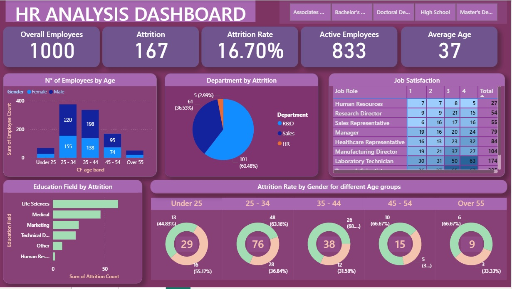

# 📊 HR Analysis Dashboard (Power BI)

## 🔍 Project Overview

This project presents an interactive **HR Analytics Dashboard** built using Power BI.
It provides insights into employee distribution, attrition trends, job satisfaction, and workforce demographics.

---

## 📌 Key Metrics

* 👥 Total Employees: 1000
* 📉 Attrition Count: 167
* 📊 Attrition Rate: 16.70%
* ✅ Active Employees: 833
* 🎂 Average Age: 37

---

## 📊 Dashboard Features

* 🔹 Employee distribution by age group
* 🔹 Attrition analysis by department
* 🔹 Job satisfaction across roles
* 🔹 Education field impact on attrition
* 🔹 Attrition rate by gender and age group

---

## 🛠 Tools & Technologies

* Power BI
* CSV Dataset
* Data Cleaning (Power Query)
* DAX Measures

---

## 📷 Dashboard Preview

---

## 🚀 How to Use

1. Download the `.pbit` file from this repository
2. Open in Power BI Desktop
3. Load dataset when prompted
4. Explore interactive visuals

---

## 📁 Files Included

* `HR_ANALYSIS_Dashboard.pbit` → Power BI Template
* `HR Data.csv` → Dataset
* `1.jpg` → Dashboard Preview

---

## 💡 Learnings

* Data cleaning and transformation using Power Query
* Creating KPIs and measures using DAX
* Designing interactive and user-friendly dashboards

---

## 📬 Contact

If you have any feedback or suggestions, feel free to connect!

---

⭐ If you like this project, don’t forget to star the repository!
